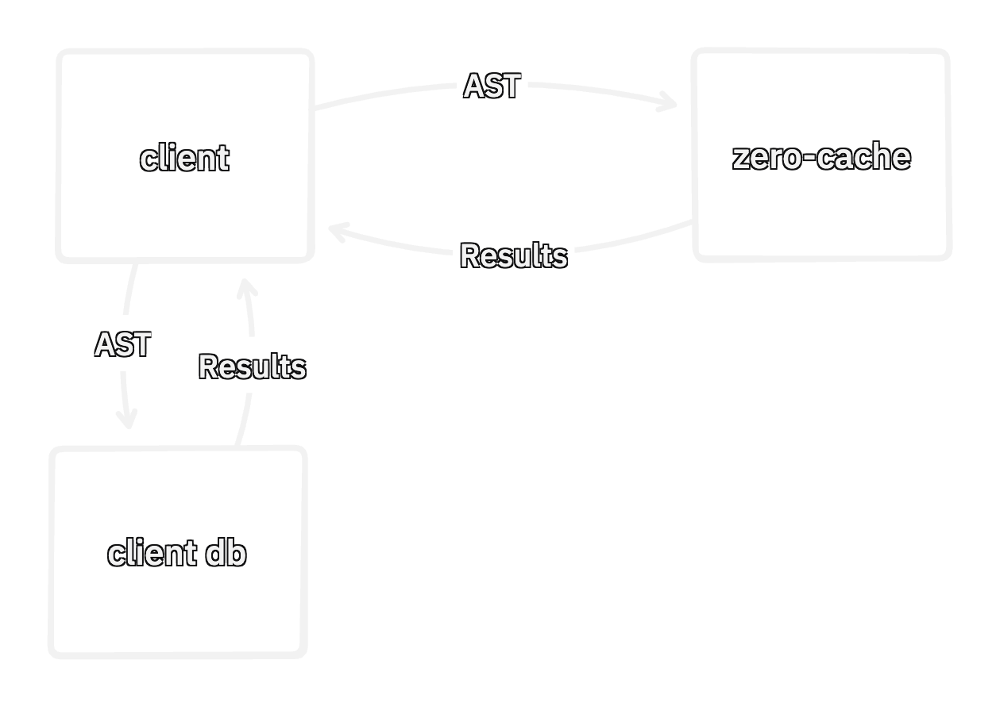
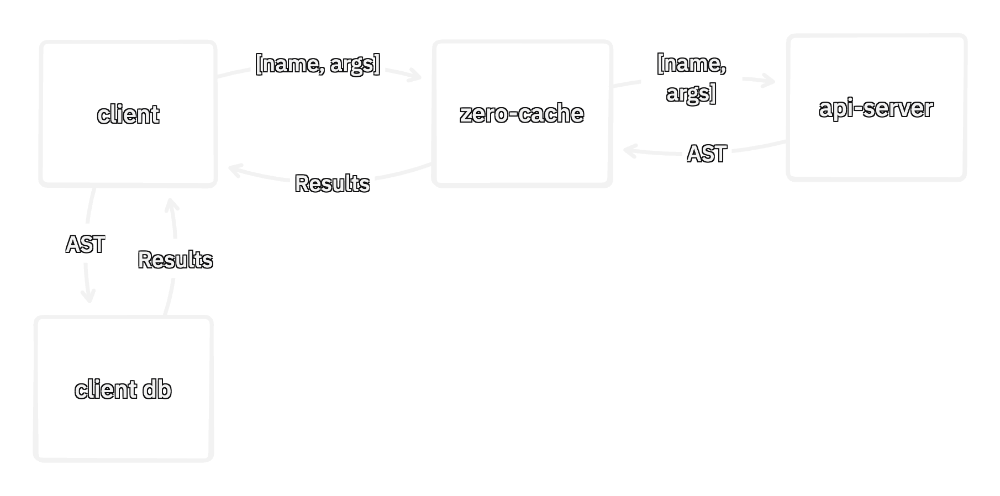

<span class="title">ZERO</span>

# Synced Queries & Custom Mutators

<div class="shimmer-mask center"></div>
<!--  -->

---

# Queries Today

<div class="two-col">
  <div class="col">

```ts
// Query
useQuery(z.query.todo.where(
  'listId',
  id
));
```
  </div>

  <div class="col">
  
```json
// AST
{ "table": "todo",
  "where": {
    "type": "simple", "op": "=",
    "left": { "type": "column", "name": "listId" },
    "right": { "type": "literal", "value": "1" },
  }, "orderBy": [["id", "asc"]] }
  ```

  </div>
</div>




---

# Problems?


---

# Problems?

- Client could craft arbitrary ASTs or QODs (.related().related().related().related()...)
- Zero-Cache must authenticate and authorize users
- Client and server query implementations have to match
- No room for custom code on the read path


---

# Synced Queries

- Locks down the server
- Custom code on read path
- Custom authorization
- Allows divergent or shared implementations on client and server

---

# Synced Query

- `[name, args]` pair sent to zero-cache instead of an AST




---

# Synced Query (Shared)

<div class="two-col">
  <div class="col">

Query is defined once. Used on both the client and server. Closest DX to current queries.
```typescript
const todoList = syncedQuery(
  'todoList',
  ({context, id}: {context: Session, id: string}) =>
    builder
      .todo
      .where('listId', id)
      .whereExists(
        'collaborators',
        q => q.where('userId', context.userId)
      )
);

useQuery(todoList);
```
  </div>
</div>


---

# Synced Query (Divergent 1)

Only check permissions on the server.

<div class="two-col">
  <div class="col">

## Client

```typescript
const todoList = syncedQuery(
  'todoList',
  ({context, id}: {context: Session, id: string}) =>
    builder
      .todo
      .where('listId', id)
);
```
  </div>
  <div class="col">

## Server

```typescript
const todoList = syncedQuery(
  'todoList',
  ({context, id}: {context: Session, id: string}) =>
    // call client impl to share base query
    clientTodoList
      // append permission check to only
      // run server side
      .whereExists(
        'collaborators',
        q => q.where('userId', context.userId)
      )
);
```
  </div>
</div>


---

# Synced Query (Divergent 2)

Custom code on read. Using 3rd party auth[n/z] tools for permissions.

<div class="two-col">
  <div class="col">

  ## Client

```typescript
const todoList = syncedQuery(
  'todoList',
  ({id}: {id: string}) => builder
    .todo
    .where('listId', id)
);
```
  </div>
  <div class="col">

## Server

```ts
const todoList = syncedQuery(
  'todoList',
  z.object({
    id: z.string(),
  }),
  async ({context, id}) => {
    // load row via drizzle
    const user = await db.query.users.findFirst({
      where: eq(users.id, context.userId),
    });
    // call Polar or some 3rd party authz service
    const allowed = await checkListAccess(
      user,
      id,
    );
    const q = clientTodoList({id}); // share / call into client impl
    return allowed ? q : q.where(alwaysFalse);
  }
);
```
  </div>
</div>


---

# Local Only

- lead in, we store rows
- can do a local only query over those rows

todo


---

# Local Modifications to Synced Queries

todo

---

# Reviving Ad-Hoc Queries

Building today's queries on top of synced queries. Key idea: `AST` can be the argument to a synced query.

- exposing how zero works, more primitives

```ts
// client.s


// server.ts
const adHoc = syncedQuery(
  'adHoc',
  astSchema,
  ({ast}) => ast,
  // Note: could inject RLS rules by walking the AST
);

// usage:
useQuery(adHoc(builder.todo.where('listId', id)))
```


<div class="note">⚠️ Notional example</div>


---

# Reviving RLS

todo


---

# Custom Mutators

- Parallel to Synced Queries
- Semantic mutations
- `[name, args]` sent to server instead of C~~R~~UD
- Similar benefits but on write


---

# Custom Mutator + Synced Queries
# = Cookie/Any Auth[n/z]

- todo: data flow
- conclusion: no mutation or read till check with api server, auth can be delegated. Even can use http-only cookies.
- delete deploy permissions
- delete rls
- first


---

# Questions?