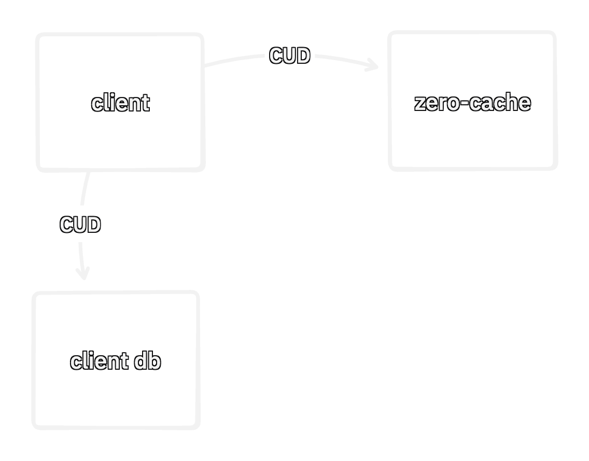
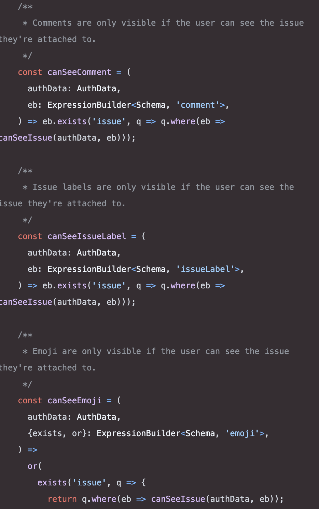

<span class="title">ZERO</span>

# Synced Queries & Custom Mutators

---

# Legacy Mutators




---

# Custom Mutators

- Set of mutations is pre-defined
- `[mutation name, args]` sent to server instead of C~~R~~UD
- Enables server authoritative writes via custom impl of mutator on the server


---

# Queries Today

<div class="two-col">
  <div class="col">

```ts
// Query
useQuery(z.query.todo.where(
  'listId',
  id
));
```
  </div>

  <div class="col">
  
```json
// AST
{ "table": "todo",
  "where": {
    "type": "simple", "op": "=",
    "left": { "type": "column", "name": "listId" },
    "right": { "type": "literal", "value": "1" },
  }, "orderBy": [["id", "asc"]] }
  ```

  </div>
</div>


---

# Problems?


---

# Problems?

- Client could craft arbitrary ASTs or QODs (.related().related().related().related()...)
- Zero-Cache must authenticate and authorize users
- Client and server query implementations have to match
- No room for custom code on the read path

```ts
/*❌ qod*/ z.query.todo.related('collaborators').related('lists').related('collaborators').related('lists')...
/*❌ jwt lock-in*/ type ZeroOptions = { auth: JWT, ... };
/*❌ read diff field?*/ todo.where('listId', ?) /*vs*/ todo.where('collectionId', ?)
/*❌ custom code*/ todo.where('foo', await sql`...`)
```


---

# Synced Queries

- Parallel of Custom Mutators
- Locks down the server
- Custom code on read path
- Custom authorization
- Allows divergent or shared implementations on client and server


---

# Synced Query

- `[name, args]` pair sent to zero-cache instead of an AST


---

# Synced Query (Shared)

<div class="two-col">
  <div class="col">

Query is defined once. Used on both the client and server. Closest DX to current queries.
```typescript
const todoList = syncedQuery(
  'todoList',
  ({context, id}: {context: Session, id: string}) =>
    builder
      .todo
      .where('listId', id)
      .whereExists(
        'collaborators',
        q => q.where('userId', context.userId)
      )
);

useQuery(todoList);
```
  </div>
</div>


---

# Synced Query (Divergent 1)

Only check permissions on the server.

<div class="two-col">
  <div class="col">

## Client

```typescript
const todoList = syncedQuery(
  'todoList',
  ({context, id}: {context: Session, id: string}) =>
    builder
      .todo
      .where('listId', id)
);
```
  </div>
  <div class="col">

## Server

```typescript
const todoList = syncedQuery(
  'todoList',
  ({context, id}: {context: Session, id: string}) =>
    // call client impl to share base query
    clientTodoList
      // append permission check to only
      // run server side
      .whereExists(
        'collaborators',
        q => q.where('userId', context.userId)
      )
);
```
  </div>
</div>


---

# Synced Query (Divergent 2)

Custom code on read. Using 3rd party auth[n/z] tools for permissions.

<div class="two-col">
  <div class="col">

  ## Client

```typescript
const todoList = syncedQuery(
  'todoList',
  ({id}: {id: string}) => builder
    .todo
    .where('listId', id)
);
```
  </div>
  <div class="col">

## Server

```ts
const todoList = syncedQuery(
  'todoList',
  z.object({
    id: z.string(),
  }),
  async ({context, id}) => {
    // load row via drizzle
    const user = await db.query.users.findFirst({
      where: eq(users.id, context.userId),
    });
    // call Polar or some 3rd party authz service
    const allowed = await checkListAccess(
      user,
      id,
    );
    const q = clientTodoList({id}); // share / call into client impl
    return allowed ? q : q.where(alwaysFalse);
  }
);
```
  </div>
</div>


---

# Example: Ad-Hoc Queries

Synced queries are the more primitive building block.

```ts
const adHoc = syncedQuery(
  'adHoc',
  astSchema,
  (ast) => queryFromAst(ast),
);

// usage:
useQuery(adHoc(builder.todo.where('listId', id).ast))
```


<div class="note">⚠️ Notional example</div>


---

# Local Only

- Bare / unnamed queries will likely become "local only"
- Local-only queries are possible due to Zero's model of syncing rows

```ts
// example: load all issues via synced query
const allIssues = syncedQuery('allIssues', () => builder.issues.related('owner').related('creator').related('labels'));
z.preload(
  allIssues()
);

// then query however you want, strictly locally
z.query.issues.where('ownerId', 1);
```

- Why? A way to manage server load


---

# Local Modifications to Synced Queries

```ts
const allLabels = syncedQuery(
  'labels',
  (id) => builder.labels
);

// ...

function labelEditor() {
  const label = useQuery(allLabels())
    .where('name', 'foo');

  return <div>{label.nameSpace} | {label.name} | {label.color}</div>;
}
```

- Local-only variant "pinned" to server side variant


---

# Custom Mutator + Synced Queries = Any Auth[n/z]

- No mutation or read till checking with the api server
- No more "deploy permissions" script
- No more custom permission system




---

# Example: RLS

```ts
// server.ts
const someQuery = syncedQuery(
  'someQuery',
  (args) => {
    let ast = builder.foo.related('bar').related('baz').ast;
    ast = spliceInRules(ast, permissionsByTable);
    return queryFromAst(ast);
  }
);

function spliceInRules(ast, permissionsByTable) {
  if (ast.where) {
    return {
      ...ast,
      where: [...ast.where, permissionsByTable[ast.table]],
      related: spliceInRules(ast, permissionsByTable),
    };
  }
  return ast;
}
```


---

# Fin

